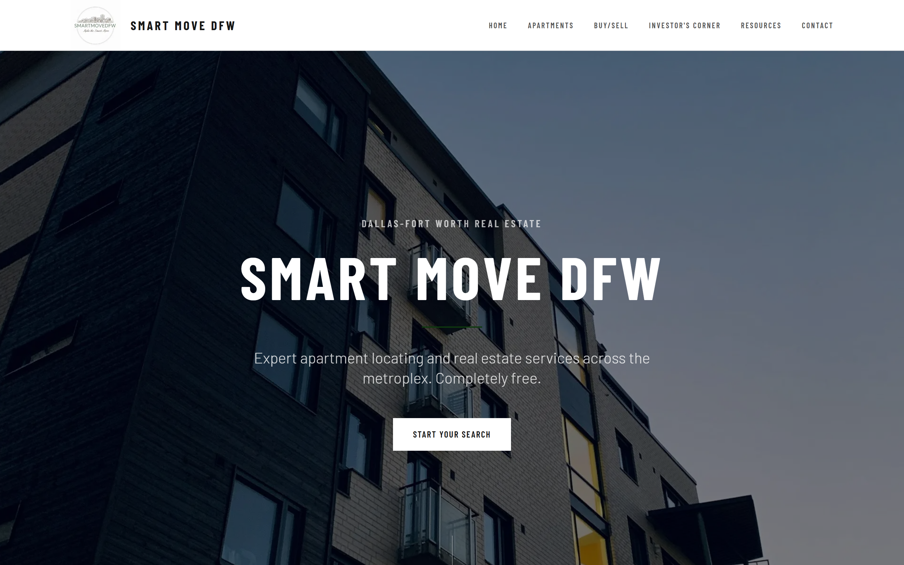

# Smart Move DFW

A real estate platform for apartment locating and property investment in the Dallas-Fort Worth area.

**Live site:** https://smartmovedfw.com



## Tech stack

Next.js 14, React 18, TypeScript, Tailwind CSS, deployed on Vercel

## Getting started

```bash
npm install
npm run dev
```

Open `http://localhost:3000`.

## Project structure

- `app/`: pages and API routes
- `components/`: shared React components (header, footer, listing cards)
- `data/`: apartment, home, and buy/sell listing data
- `public/`: static assets

## Note on the data in this repo

The listing data here is sample data for demonstration, not the live inventory shown on the site above. Same structure and interfaces as production, different content.

## Deployment

Deployed on Vercel with CI/CD from GitHub on every push to main.
